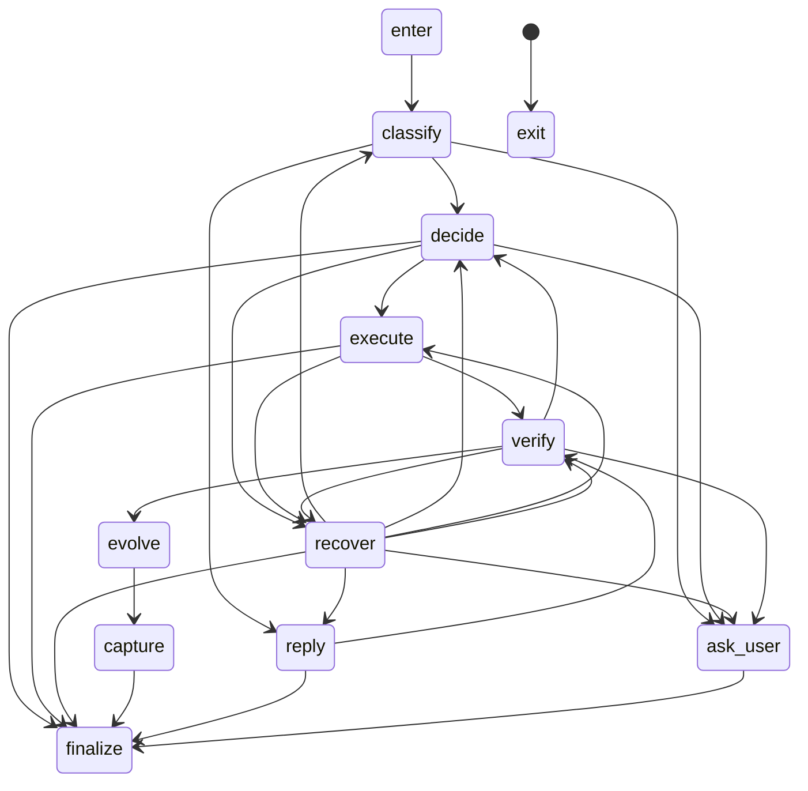

# Core Flow 状态契约

最后更新：2026-08-10 00:10:00

本页是 Harness 状态边和高频 `RunContext` 字段责任的导航入口。可执行契约位于 `packages/types/src/stage-transitions.ts` 与 `packages/types/src/run-context-contract.ts`；本页只解释如何阅读和扩展它们，不复制运行时实现。

## 状态边

`allowedTransitions` 是 Core Flow 唯一允许的 Stage 边表。每次 stage 或 hook 返回 `StageResult` 后，Harness 在进入下一轮前调用 `inspectStageTransition`。边不在 manifest 中时，Runtime 会把结果收敛为 `ok: false`、`next: 'exit'`，并在 `meta.transitionViolation` 中保留来源、目标和允许目标；不会让自定义 stage 或 hook 静默跳过安全流程。

每个 stage 都保留 `exit` 终止边，因为运行时暂停、中断、异常和 Provider 失败必须有明确的终态出口。`execute -> finalize` 是自定义轻量执行 stage 的兼容边：默认 TaskBook/工具循环仍然经过 `verify`。

扩展 stage 时必须先为边补 manifest 和回归测试，再注册 stage。不要在模型输出、hook 或临时分支中增加未登记的 `next`；`StageResult.next` 不是自由路由字段。

## Runner Coordinator

Runner 的最小 coordinator 由 `packages/runner/src/runner-coordinator.ts` 约束，固定执行 `prepare -> execute -> finalize -> persist`。`runner-execute.ts` 只负责 Harness 与运行时 checkpoint，`runner-finalize.ts` 负责记忆/会话收尾与结果装配，`runner-persist.ts` 负责 execution log、上一轮摘要和版本 checkpoint 完成；这些 helper 不重新承担 LLM 语义决策。

## RunContext Ownership

Ownership manifest 目前登记 40 个字段，按八组高频共享状态提供可审计的字段 owner、读阶段、写阶段和生命周期边界。它不是把已有 `RunContext` 改成代理对象，而是要求生产写入经过对应领域边界；测试夹具仍可直接构造上下文。

| 分组 | 代表字段 | owner | 主要写入阶段 | 生命周期 |
| --- | --- | --- | --- | --- |
| `reply` | `reply`、`replyProvenance`、`usage` | `user-facing-reply-boundary` / `model-observability` | `reply`、`execute`、`recover`、`ask_user`；`reply` 与 `replyProvenance` 通过 `reply-state.ts` 批次写入，顶层 usage 通过 `usage-state.ts` 批次写入；请求级 usage 仍由 `model-observability.ts` 绑定到 `contextSnapshots` | `run-local` |
| `replan` | `taskBook`、`plan`、`taskBookRevision`、`taskExecution`、`replanAttempts`、`verifyFeedback`、`partialReplanRequest`、`replanHistory`、`appliedTaskBookPatchIds` | `decide-taskbook-boundary` / `execute-taskbook-boundary` / `verify-replan-boundary` / `runtime-taskbook-boundary` | `decide`、`execute`、`verify`、`recover`、`runtime-boundary`、`runner-restore` | `checkpoint-carried` |
| `decision` | `classification`、`needAssessment`、`clarificationRequest`、`clarificationResponse` | `activity-routing-boundary` / `decide-demand-boundary` / `clarification-boundary` | `classify`、`decide`、`recover`、`verify`、`ask_user`、`runner-init`、`runner-restore` | `checkpoint-carried` 或 `run-local` |
| `failure` | `lastError`、`recoveryAttempts` | `failure-recovery-boundary` | `lastError`：Core Flow 各 stage、`runner-restore`、`post-run`；`recoveryAttempts`：`runner-init`、`recover`、`runner-restore`，均通过 `failure-state.ts` 批次写入 | `run-local` / `checkpoint-carried` |
| `executionEvidence` | `toolResults`、`toolInvocations`、`toolInvocationsTruncated`、`sideEffects` | `execute-result-boundary` / `tool-invocation-evidence` / `side-effect-ledger` | EXECUTE 顶层结果、ToolExecutionService 调用记录和副作用账本；初始化与 checkpoint restore 通过 `execution-evidence-state.ts` 接入，账本内部更新也通过不可变替换提交 | `run-local` / `checkpoint-carried` |
| `modelObservability` | `modelCallCount`、`modelRequests`、`contextSnapshots` | `model-observability-state` / `model-observability` | 模型请求准备与调用计数、受限请求快照和 Context 快照；初始化与 checkpoint restore 的调用计数通过 `model-observability-state.ts` 接入，`contextSnapshots[].providerUsage` 保持请求级嵌套观测 | `modelCallCount`: `checkpoint-carried`；其余：`run-local` |
| `runtimeControl` | `runtimeControl`、`runtimeEventQueue`、`deferredRuntimeEvents`、`deferredRuntimeEventIds`、`loopBudget` | `runtime-control-boundary` / `runtime-state` / `runner-runtime-queue` / `runner-runtime-budget` | Runtime safe boundary、DECIDE 延迟事件消费、Runner 初始化/恢复；顶层批次写入统一经过 `runtime-state.ts` | `run-local` 或 `checkpoint-carried` |
| `memory` | `prelude`、`sessionSummary`、`memoryRootIndex`、`initialMemoryContext`、`memoryKnownState`、`memoryContinuityAssessment`、`memoryContextWorkingSet`、`evolutionNotes`、`insights`、`memoryIntentDecisions` | `runner-memory-bootstrap` / `memory-evidence-boundary` / `memory-context-boundary` / `evolve-memory-boundary` / `capture-memory-boundary` / `finalize-memory-continuity` / `memory-intent-gate` | Runner 初始化/恢复、DECIDE、EXECUTE、VERIFY、REPLY、EVOLVE、CAPTURE、FINALIZE；所有顶层 Memory 批次写入统一经过 `packages/harness/src/memory-state.ts` | `run-local`、`checkpoint-carried` 或 `session-persisted` |

机器可读字段表通过 `getRunContextFieldContract`、`runContextFieldsForGroup` 和 `assertRunContextFieldWriteAllowed` 查询。阶段 5C 已将 replan 组的顶层生产写入集中到 `packages/harness/src/replan-state.ts`；阶段 5D 已将 `reply` 与 `replyProvenance` 集中到 `packages/harness/src/reply-state.ts`；阶段 5E 已将 runtimeControl 组集中到 `packages/harness/src/runtime-state.ts`；阶段 5F 已将 Memory 顶层字段集中到 `packages/harness/src/memory-state.ts`；阶段 5G 已将顶层 `usage` 快照集中到 `packages/harness/src/usage-state.ts`；阶段 5H 已将决策与澄清字段集中到 `packages/harness/src/decision-state.ts`；阶段 5I 已将 `lastError` 与 `recoveryAttempts` 集中到 `packages/harness/src/failure-state.ts`；阶段 5J 已将执行证据字段集中到 `packages/harness/src/execution-evidence-state.ts`；阶段 5K 已将模型观测字段集中到 `packages/harness/src/model-observability-state.ts`。这些入口都会先完成整批字段校验，再一次性写入，非法阶段不会留下半更新。`decision-state.ts` 负责活动路由、需求评估和澄清请求/响应的 RunContext 顶层状态；`failure-state.ts` 负责跨阶段失败证据和有界恢复计数，不负责模型观测或执行证据；`execution-evidence-state.ts` 负责顶层执行证据投影、调用记录有界 upsert 和副作用账本的不可变替换，不代理 TaskBook 内部 `stageResults[*].toolResults`；`model-observability-state.ts` 负责三个顶层模型观测字段的批次校验、有界追加和不可变快照更新，不代理模型请求构造语义；`usage-state.ts` 不代理请求级 `contextSnapshots[].providerUsage` 观测；`memory-state.ts` 只负责 RunContext 顶层状态，不代理 Memory Repository/Service 的持久化事务；`runtimeEventQueue` 内部的 open/settle/lease、幂等和快照恢复状态仍由 `packages/runner/src/runtime-event-queue.ts` 自己拥有，不属于 RunContext 写入边界。TaskBook 内部的 `stageResults` 仍由 EXECUTE 在同一 TaskBook 内更新，这是明确保留的嵌套执行证据边界。

阶段 5L 的 checkpoint 边界会把当前 `modelCallCount` 重concile 到持久化 `loopBudget.attemptsUsed`，并把 `maxModelCalls` 重concile 到 `loopBudget.maxAttempts`；这只是两个既有 owner 之间的确定性映射，不新增 ownership group，也不让 `model-observability-state.ts` 直接写入 runtime 字段。

阶段 5M 的 snapshot 生命周期边界统一使用 `MAX_MODEL_REQUEST_SNAPSHOTS_PER_RUN = 64`：`RunContext` 的模型观测入口、checkpoint 的 `contextSnapshotIds` 和 execution log 的 `modelRequests`/`contextSnapshots` 都以最近 64 条为有效窗口。checkpoint 只保存 ID，不改变既有 schema；execution log 在持久化边界再次截断，并以截断后的 snapshot 集合建立资源索引，避免引用窗口和实际持久化内容分叉。`contextSnapshots[].providerUsage` 仍是请求级嵌套观测，不提升为顶层字段。

阶段 5N 将 checkpoint store 的读写边界明确分离：新写入通过 `MAX_MODEL_REQUEST_SNAPSHOTS_PER_RUN = 64` 校验，防止绕过 `buildRunCheckpoint()` 的统一窗口；读取和诊断继续接受最多 128 条历史 `contextSnapshotIds`，保证 5M 以前的 checkpoint 可检查和迁移。该兼容分支只影响输入校验，不改变公共 checkpoint schema 或恢复 owner。

阶段 5O 将 `appendModelObservations()` 的调用参数视为提示而不是权限：入口内部把非有限值、非整数值和过大值归一化到 `1..MAX_MODEL_REQUEST_SNAPSHOTS_PER_RUN`，因此公开状态 API 无法扩大模型 request/context snapshot 的运行时窗口。两个观测数组继续使用同一归一化后的上限，保持尾部关联和不可变批次写入。

## 修改规则

1. 先修改 manifest，再修改使用方；保持公共 `RunContext` 字段和 checkpoint 格式兼容。
2. 新增 Stage 边必须增加非法边拒绝测试和至少一条真实流程回归。
3. 新增高频共享字段必须登记 group、owner、读写阶段、生命周期和 purpose；未知字段不能被 ownership 查询假装为已治理。
4. Harness/Runner/Context/Memory 公共契约变更运行 `pnpm.cmd run verify:core`；阶段结束再运行 `pnpm.cmd run verify:full`。
