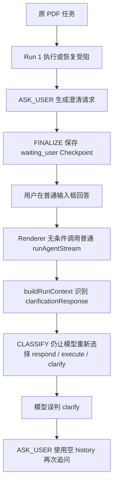
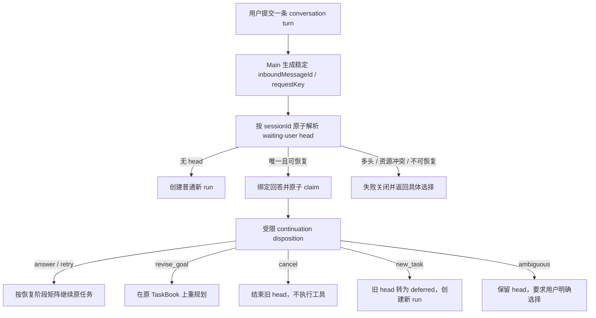

# LittleSheep 对话任务连续性 P0 专项任务书 2026-08-13

状态：**未关闭**（2026-09-22 复核：中层机制已随状态机重设计落地，发布级验收仍缺）
最后更新：2026-09-24 17:52:31

> **2026-09-22 复核边界（优先于下文 §15 的“全待开始”状态表）**：本任务书赖以成立的故障链——`classify` 调用分类模型 → `ask_user` → `finalize` 存 `waiting_user` → 下一条消息被当作独立新任务重新分类——在当前架构中已不可复现：`classify` 不再调用模型，stage 注册表已无 `decide`，且**生产代码不再产生新的 `waiting_user` 检查点**（`packages/runner/src/run-checkpoint.ts`、`run-checkpoint-controller.ts` 里的等待头解析只服务磁盘上遗留的旧检查点与测试夹具）。
>
> 已按当前代码复核并关闭：CTC-P0-01～11 的机制实现（唯一 head、原子 claim、disposition、语义恢复阶段、资源 manifest 与工具配方、权限重验、副作用幂等、并发与重启幂等）、§3.2 不变量 1–9、§4.2/§4.4、§9.3 正例与 §9.4 负例（单元/契约层）、§10.1 结构化证据。
>
> 仍未关闭（本任务书继续跟踪）：**0.2 的“回答连续”**与 **CTC-P0-12**（最终回复承接原目标目前只有文本重叠启发式，没有交付物级硬门）；**P0-E2E-001 真实验收**（仓库内不存在该断言脚本，`scripts/prepare-electron-conversation-continuity-e2e.mjs` 只准备夹具且未接入 `package.json`）；**§10.2 发布指标门**（无 8 项硬计数聚合判定）；**§11.2 只读迁移扫描**与 **§11.3 回滚演练**；**§5.3 附件 lease 生命周期**与 **§5.4 配方版本/schema hash**；**§4.1/§4.3 的 `ambiguous` 语义**（现状是放弃旧头当新任务执行，与原文“保留 head 要求用户选择”相反）；§8 阶段 0 baseline 报告与阶段 2 的 TaskBook patch。
>
> 关闭本专项的正确动作是**按当前单主循环架构逐条重述并补发布级验收**，而不是重新实现旧的等待用户链路；机制层事实已汇入 [Core Flow 状态契约](../reference/core-flow-state-contract.md) 与 [项目状态](../decision/project-status.md)。

> 核心结论：本次故障不是“上一轮文本没有进入 Context”，而是“等待用户输入的原任务没有成为下一条普通聊天消息的权威续接对象”。历史文本存在，但任务、执行现场、附件、临时工具和恢复阶段没有一起续上，因此系统仍会把“你再试试”当作独立新请求重新分类。

> P0 发布边界：在本任务书的五层连续性验收全部通过前，不得宣称“上下文连续”“任务可续接”或“Checkpoint 恢复已覆盖普通对话”。只验证历史文本、摘要、Memory、Checkpoint 文件存在，均不能作为修复完成证据。

> 历史证据边界：第 1 节记录 2026-08-13 用户真实故障的脱敏运行事实，仅用于复现与追踪；当前实现状态、测试数量和发布结论必须在实施时重新生成，不得把本文的诊断快照当成未来版本的通过证明。

本文是 Runtime 连续性方向的 P0 专项补充（原《Agent Runtime 连续性任务书 2026-07-14》已于 2026-09-24 退役，其未完成方向并入[项目状态](../decision/project-status.md) 的"未完成方向"，原文可取回：`git log --follow -- docs/taskbooks/agent-runtime-continuity-taskbook-2026-07-14.md`）。原任务书覆盖 Context、记忆、附件、Checkpoint、重启与后台运行的总体能力；本文只处理一个更严格的产品契约：**用户在同一对话中回答 LS 刚刚提出的问题、补充权限、补充工具或要求重试时，LS 必须继续原任务，而不是创建一个失去执行现场的新任务。**

## 0. 执行摘要

### 0.1 严重级别

严重级别：`P0 / 核心流程阻断`。

影响不是回复质量下降，而是 Core Flow 在 `ASK_USER -> 用户回答` 之后断链。任何需要澄清、批准、附件、工具补充、登录、权限变化、人工选择或失败恢复的任务，都可能在最需要连续性的地方丢失原目标。对长任务而言，这等价于 TaskBook、已完成步骤、失败现场和资源引用不可依赖。

### 0.2 修复完成的唯一口径

修复必须同时通过以下五层，少一层均不得关闭 P0：

| 层级 | 必须连续的对象 | 通过条件 |
| --- | --- | --- |
| 文本连续 | 最近用户消息、Assistant 问题、当前回答 | 真实进入需要它们的模型请求，且没有被错误裁剪或重复持久化 |
| 任务连续 | 原始目标、范围、验收标准、TaskBook revision | 当前回答绑定原任务；不得重新猜测成无关新任务 |
| 执行现场连续 | 已完成/失败/进行中步骤、验证历史、错误、恢复次数、副作用账本 | 恢复只重做必要步骤，不整本重建，不丢失失败原因 |
| 资源连续 | 附件、工作区、受管缓存、临时工具配方、当前权限 | 资源可重新解析、校验和授权；不能只保留数量或旧闭包 |
| 回答连续 | 最终可见回复与交付物 | 回复明确承接原目标并交付有效结果；内部恢复成功但最终仍重复追问不算通过 |

### 0.3 本轮范围

本轮任务书完成以下工作：

- 固化真实故障证据、根因链和测试缺口。
- 定义普通聊天与 waiting-user Checkpoint 的统一续接契约。
- 定义会话级唯一待续接头、原子 claim、续接分流和恢复阶段矩阵。
- 定义附件、临时工具、权限和副作用的恢复边界。
- 定义分阶段实现、迁移、回滚、可观测性和发布质量门。

本轮不修改 Harness、Runner、Local App API、Renderer 或附件代码，也不把任务书创建本身标记为 P0 已解决。

## 1. 真实故障证据与根因

### 1.1 事件证据

| 证据 | 事实 |
| --- | --- |
| 会话 ID | `da3eb3b2-915b-49e3-9e3d-1004732c262e` |
| 原任务 run | `e2d39b49-b235-44c8-a465-a95214929f3f` |
| 回答 run | `bf749a55-c61f-49a1-a709-2f3fcafdc1be` |
| waiting-user Checkpoint | `run-checkpoint-75028696-5f65-47d8-a4fb-861b0fbc0eb0` |
| 原始目标 | 按原排版把附件 PDF 翻译成中文，并仍以 PDF 交付 |
| LS 首轮状态 | 表示无法直接读取/生成/校验 PDF，请求用户提供文字或交付方式 |
| 用户回答 | `给你权限和相关工具了，你再试试` |
| 错误结果 | 再次表示当前消息不足，并要求补充具体事项 |

原始 execution log 位于活动数据根的 `execution-logs/`；Checkpoint 位于 `run-checkpoints/`。用户提供的截图是本次诊断输入，不作为未来自动化测试依赖，回归测试必须使用仓库内可复现的脱敏夹具。

### 1.2 已排除“历史文本丢失”

第二轮与第一轮属于同一会话。第二轮模型 Context 中实际包含：

- 上一轮用户请求，45 个字符；状态为 `included`。
- 上一轮 Assistant 回复，71 个字符；状态为 `included`。
- 当前用户回答，15 个字符；状态为 `included`。

`buildRunContext()` 还正确生成了：

```json
{
  "requestId": "e2d39b49-b235-44c8-a465-a95214929f3f:clarification",
  "answer": "给你权限和相关工具了，你再试试"
}
```

因此，单纯扩大历史窗口、修改摘要或增加 Memory 注入不能解决本问题。

### 1.3 当前错误链路



第二轮实际 stage 路径为：

```text
enter -> classify -> ask_user -> finalize
```

实际分类结果为：

```json
{
  "activity": "clarify",
  "confidence": 0.92,
  "reason": "用户提到给了权限和相关工具，但当前未提供可读取的 PDF 文件或具体工具调用方式"
}
```

这说明任务是否连续被错误地交给了概率分类，而 Runtime 已经拥有的结构化澄清关系没有成为控制流事实。

### 1.4 根因分解

| 编号 | 根因 | 当前证据 | 修复责任边界 |
| --- | --- | --- | --- |
| RC-1 | 普通聊天入口不知道 waiting-user Checkpoint | `run-actions.ts` 无条件调用 `runAgentStream()` | Main/Runner 提供统一、原子的 conversation turn 入口；Renderer 不独立猜测 |
| RC-2 | `clarificationResponse` 只是 Context 字段，不是硬路由条件 | `context.ts` 写入字段后，`classify.ts` 仍调用分类器 | Harness/Runner 在 CLASSIFY 前建立 continuation binding |
| RC-3 | 通用分类器被要求猜测“这是否仍是旧任务” | 第二轮历史完整但仍输出 `clarify` | 待续接关系由 Runtime 决定；模型只在绑定后的受限语义分流中工作 |
| RC-4 | 误入 ASK_USER 后缺少纠偏材料 | `ask_user.ts` 构造请求时使用 `history: []` | ASK_USER 使用有界 clarification chain 和 workflow state |
| RC-5 | Checkpoint 保存了执行现场，但普通输入未使用它 | waiting-user Checkpoint 保留 TaskBook、失败步骤和验证信息 | 会话级待续接头查询、claim 与普通聊天统一 |
| RC-6 | 附件只能按 run 使用 | UI 发送后清空附件；`RunAttachment` 明确 run-scoped | 持久化可恢复资源引用并在续跑前重新解析 |
| RC-7 | 临时附件工具无法重建 | `inspect_attachment` 是首轮 `additionalTools` 临时工具 | 保存受限工具配方，由受信任 factory 重建，禁止持久化闭包 |
| RC-8 | waiting-user Checkpoint 的恢复阶段错误 | `currentStage === finalize` 被映射为 `reply` | 根据澄清来源、TaskBook 和失败现场计算语义恢复阶段 |
| RC-9 | 旧权限可能被错误沿用 | resume 当前读取 Checkpoint 中旧 `permissionPolicyId` | 每次续跑按当前 App 模式和实际路径重新求值 |

### 1.5 为什么现有测试没有发现

现有 `context.test.ts` 只证明当前消息可写入 `clarificationResponse`，没有证明该字段改变后续控制流。现有 Runner continuation 测试主要覆盖中断恢复、消息不重复和不确定副作用失败关闭，也没有覆盖普通聊天回答 waiting-user Checkpoint。

缺失的关键断言包括：

- 已绑定澄清回答不得再次进入通用 `clarify` 分类。
- 普通聊天必须发现并 claim 同会话唯一 waiting-user 头。
- 恢复必须携带原 TaskBook、失败现场、验证历史和资源引用。
- 权限或工具变化后必须重新求值并继续原步骤。
- 有附件的 waiting-user Checkpoint 必须可恢复，而不是因 `attachmentCount > 0` 被永久判为不可恢复。
- “明确新任务、取消、修改目标”不能误执行旧任务。
- 重启、请求重试、SSE 断开和并发发送不能双恢复或双写消息。
- 最终回复和 PDF 交付物必须承接原目标，不能只验证内部字段存在。

## 2. 目标与非目标

### 2.1 目标

- 同一会话存在唯一可续接 waiting-user 头时，普通用户回答默认与其建立结构化绑定。
- 绑定发生在通用活动分类之前，不依赖关键词、分类置信度或最近消息的模糊相似度。
- 用户回答、补充权限、补充工具、重新登录、重新附加资源或要求重试时，恢复原任务的最小必要现场。
- 用户明确取消、替换目标或开始新任务时，Runtime 以可审计 disposition 处理旧头，不静默混合两个任务。
- Checkpoint 恢复在同进程、应用重启、网络重试和 UI 重连后保持相同语义。
- 已完成副作用不重放；状态未知的外部副作用失败关闭。
- 最终回答级连续性和真实交付物成为发布门。

### 2.2 非目标

- 不重写 Memory v3、会话摘要或普通历史裁剪系统。
- 不以增加 Prompt 长度代替控制流修复。
- 不新增关键词表来识别“继续”“再试试”“权限”等表达。
- 不把所有历史 Checkpoint 自动恢复；只有同会话、可验证、唯一且未 disposition 的待续接头可以自动绑定。
- 不持久化任意工具闭包、函数源码、未清洗二进制内容或未经验证的绝对路径。
- 不沿用旧审批结果来绕过当前权限闸门。
- 不在资源缺失、哈希变化、多头冲突或副作用未知时猜测执行。
- 不因为内部测试通过就省略真实 Electron、真实 Provider 和 PDF 交付验收。

## 3. 强制连续性契约

### 3.1 需求追踪编号

| ID | 强制要求 |
| --- | --- |
| CTC-P0-01 | waiting-user 回答必须在通用 CLASSIFY 前绑定原 Checkpoint |
| CTC-P0-02 | 每个会话最多一个可自动续接的 waiting-user head |
| CTC-P0-03 | 每条用户回答最多消费一次，每个 Checkpoint 同时最多一个 resume claim |
| CTC-P0-04 | 续跑必须恢复原目标、TaskBook、步骤状态、错误、验证和副作用账本 |
| CTC-P0-05 | `finalize` 只是保存位置，不能作为语义恢复目标直接映射到 `reply` |
| CTC-P0-06 | 附件和临时工具必须通过可验证资源引用与受信任配方重建 |
| CTC-P0-07 | 当前权限、工作区和路径边界必须在续跑时重新计算 |
| CTC-P0-08 | 已完成副作用不得重放，未知外部副作用不得自动继续 |
| CTC-P0-09 | 用户取消、新任务、目标修改和回答原问题必须有不同 disposition |
| CTC-P0-10 | 资源或多头冲突必须失败关闭，并给出具体可恢复动作 |
| CTC-P0-11 | 普通输入、显式恢复面板和启动恢复必须复用同一 continuation coordinator |
| CTC-P0-12 | 最终可见回复必须明确承接原目标；重复原问题判为失败 |

### 3.2 不变量

1. `clarificationResponse.requestId` 必须等于被回答的 `clarificationRequest.id`，且该请求属于被 claim 的 Checkpoint。
2. 不能仅根据“最近一条 Assistant 文本像问题”建立续接；必须存在结构化未解决请求和可验证 Checkpoint。
3. Renderer 可以展示候选状态，但 Main/Runner 是唯一权威绑定与 claim 边界，避免列表查询和执行之间的竞态。
4. waiting-user 头一旦被某个 `answerMessageId + resumeRunId` claim，其他进程、窗口或重试只能幂等加入同一结果，不能创建第二次执行。
5. 新回答只持久化一次。续跑不得再次追加原始首轮 inbound，也不得把同一回答同时写成“普通新 run 输入”和“Checkpoint 回答”。
6. 恢复前先解析资源、权限和副作用；任何一项失败都不能进入会产生新副作用的 stage。
7. `clarificationRequest` 被回答后必须转为 resolved/consumed 状态，不能继续作为新的 pending 请求触发相同问题。
8. 若恢复后仍需新信息，必须创建新的 request ID，并只询问尚未解决的字段。
9. 任何旧 Checkpoint 迁移都不得通过附件名、数量、时间接近或路径相似来猜测资源身份。
10. 连续性状态只在最终回复及交付物验证通过时标为 `supported`；内部 binding、restore 或工具执行成功只是中间证据。

## 4. 目标控制流

### 4.1 统一 conversation turn 入口

Renderer 的普通发送、显式 Checkpoint 恢复和应用启动后的恢复控制面，最终都必须调用 Main 中同一个 `ContinuationCoordinator`。Renderer 不再执行“先列出 Checkpoint，再自行决定调用哪个端点”的非原子流程。



结构化绑定是 Runtime 决策；模型不得决定旧任务是否存在。自然语言中的“回答、重试、修改目标、取消、新任务”仍可由 LLM 在已经绑定的原任务上下文中输出受限枚举，但该输出不使用通用 `respond / execute / clarify` 分类器，不以置信度直接授权执行，并由 Runtime 校验状态转移。无效、冲突或无法解释的输出进入用户选择，不执行副作用。

### 4.2 会话级唯一 waiting-user head

Runner/Checkpoint 控制面需要提供原子接口，语义至少覆盖：

```ts
type WaitingUserHeadResolution =
  | { kind: 'none' }
  | { kind: 'eligible'; checkpointId: string; requestId: string }
  | { kind: 'blocked'; checkpointId: string; reasons: string[] }
  | { kind: 'conflict'; checkpointIds: string[] };

interface ConversationContinuationStore {
  resolveWaitingUserHead(sessionId: SessionId): Promise<WaitingUserHeadResolution>;
  claimAnswer(input: {
    checkpointId: string;
    requestId: string;
    answerMessageId: string;
    resumeRunId: string;
    requestKey: string;
  }): Promise<'claimed' | 'same_claim' | 'conflict'>;
}
```

具体类型名可按仓库所有权调整，但必须保留这些语义：

- 只返回未完成、未放弃、未 deferred、没有活动 lease 的 `waiting_user` Checkpoint。
- 同一会话出现多个合格头时不任取“最新一个”；返回 conflict，并要求显式选择或先做确定性修复。
- `same_claim` 用于网络重试和 Renderer 重连；必须复用已有 resume run，而不是重复执行。
- 新写入 waiting-user 头时，必须原子替换或拒绝既有自动头；历史 Checkpoint 可以保留，但不能同时自动匹配。

### 4.3 续接分流

| 分流 | 用户语义 | 旧 Checkpoint disposition | 后续动作 |
| --- | --- | --- | --- |
| `answer` | 回答刚才问题、补充缺失事实 | `resuming` | 恢复原任务 |
| `retry` | 权限、工具、登录或资源已变化，要求重试 | `resuming` | 重新求值后恢复失败/受阻步骤 |
| `revise_goal` | 修改原交付物、范围或验收标准 | `resuming` | 保留已完成证据，回到 DECIDE 做 TaskBook patch |
| `cancel` | 明确取消原任务 | `abandoned` | 不执行工具，保留审计和已有产物 |
| `new_task` | 明确开始无关的新任务 | `deferred` | 旧任务退出自动 head，仍可从恢复控制面显式继续；新任务走普通入口 |
| `ambiguous` | 无法安全区分 | 不变 | 显示原任务摘要和选项，等待用户选择 |

`deferred` 若不扩展现有 disposition 枚举，可用等价、可恢复且不会自动匹配的状态表达；不得用删除 Checkpoint 或伪装成 `completed` 实现。

### 4.4 语义恢复阶段矩阵

Checkpoint 的 `currentStage` 表示保存发生在哪里，不一定表示收到用户回答后应该去哪。恢复目标必须由 `clarificationRequest.sourceStage`、TaskBook、步骤状态、错误和回答类型共同计算。

| 澄清来源或现场 | 回答类型 | 目标 stage | 约束 |
| --- | --- | --- | --- |
| `classify` 的语义不明 | `answer` | `decide` | 禁止再次走通用 CLASSIFY |
| `decide` 缺目标、范围或验收标准 | `answer` | `decide` | 合并回答后更新原 TaskBook，不创建第二本 |
| `execute` 缺参数、资源或批准 | `answer / retry` | `recover` | 先重验资源与权限，再只重试受阻步骤 |
| `recover` 等待工具、权限、登录或人工动作 | `retry` | `recover` | 保留 lastError、attempt 和已完成步骤 |
| `verify` 等待验收选择 | `answer / revise_goal` | `decide` | 更新验收标准后再执行或验证 |
| `ask_user / finalize` 保存的 waiting-user | 任意 | 按 `sourceStage` 计算 | 禁止固定映射为 `reply` |
| 用户取消 | `cancel` | `finalize` | 不进入执行 |
| 用户新任务 | `new_task` | 新 run 的 `classify` | 旧任务先退出自动 head |

### 4.5 澄清链状态

现有 `clarificationRequest` 与 `clarificationResponse` 需要形成可审计生命周期，而不是两个松散可选字段。最低要求：

- pending 请求有稳定 ID、来源 stage、问题字段、阻断原因和创建时间。
- 回答绑定 request ID、answer message ID、回答时间和 continuation claim。
- 进入恢复前原请求被标记为 `resolved` 或 `consumed`。
- 后续 ASK_USER 请求携带原目标摘要、已回答字段、剩余阻断、TaskBook/失败现场和资源状态的有界 `clarification_chain`。
- ASK_USER 不再用无条件 `history: []` 丢弃纠偏依据；也不能把整个长会话无界注入。
- 新问题必须使用新 ID，并通过字段或语义指纹防止原问题原样重复。

## 5. Checkpoint 与资源恢复契约

### 5.1 兼容策略

优先采用可兼容扩展：保留 `RunCheckpoint.version = 1` 的外层存储框架，在 `resumeState` 中增加经过版本标识的 continuation/resource block；新 Reader 同时支持旧形态和新形态。若实现验证证明现有 validator 无法安全兼容，再把 `resumeState` 升为 v2，但必须提供 v1/v2 双读、不可变迁移和降级行为测试。

不允许原地批量改写历史 Checkpoint。旧版本只能在读取时规范化，或写入新的派生记录并保留来源 ID。

### 5.2 必须新增的可恢复信息

下面是语义示例，不要求逐字采用字段名：

```json
{
  "continuation": {
    "version": 2,
    "kind": "clarification",
    "requestId": "source-run:clarification",
    "sourceStage": "recover",
    "questionFields": ["tool_or_permission"],
    "resumePolicy": "derive_from_source_stage"
  },
  "resources": {
    "attachments": [
      {
        "cacheId": "stable-managed-cache-id",
        "sha256": "verified-digest",
        "name": "source.pdf",
        "mimeType": "application/pdf",
        "size": 12345,
        "kind": "document"
      }
    ],
    "toolRecipes": [
      {
        "factory": "inspect_attachment",
        "version": 1,
        "resourceIds": ["stable-managed-cache-id"]
      }
    ]
  }
}
```

Checkpoint 仍保留已有的原目标、TaskBook、TaskExecution、classification、needAssessment、plan、verificationHistory、sideEffects、runtime events、workspace context 和循环预算。新增 block 解决的是当前只保存 `attachmentCount` 和工具名称导致的不可恢复问题。

### 5.3 附件恢复

- 首轮运行前，所有需要跨 run 的附件必须转换为受管缓存引用，或登记为可重新验证的授权工作区资源引用。
- waiting-user、paused 和 recoverable Checkpoint 对其受管附件建立有界 lease/pin；缓存清理不得删除仍被有效 Checkpoint 引用的条目。
- Checkpoint 完成、放弃、过期或资源被显式替换后释放 lease；清理过程必须保留引用审计。
- 恢复时按 cache ID 重新解析真实路径，重新检查普通文件、符号链接、大小、MIME、SHA-256、所有权和当前容器边界。
- 哈希、大小或边界变化时不得静默使用；进入 `needs_resource_rebind`，明确要求用户重新附加哪一个资源。
- 外部或工作区文件不得只凭历史绝对路径继续读取；必须按当前权限重新授权。
- Checkpoint 中不保存原始 PDF 二进制、data URL 或模型已展开的全文。

### 5.4 临时工具恢复

`additionalTools` 中的运行时闭包不能直接持久化。可恢复工具必须来自受信任、版本化 factory：

- Checkpoint 只保存 factory ID、版本、资源引用、schema hash 和最小配置。
- Runner 恢复时从当前注册表调用 factory 重建工具，再次检查工具来源、schema、资源声明、副作用和权限。
- `inspect_attachment` 必须由已验证附件 manifest 重建，不能只因为旧 `availableToolNames` 包含该名称就视为可用。
- factory 缺失、版本不兼容或 schema 变化时失败关闭，告诉用户缺少哪项能力；不得降级成通用 shell 或猜测替代工具。
- 临时工具重建成功后，Checkpoint 的旧工具名只作审计，不作当前执行授权。

### 5.5 旧 Checkpoint

| 旧数据情况 | 行为 |
| --- | --- |
| 无附件、工具均为当前稳定注册工具 | 按 v1 兼容路径恢复 |
| 会话消息中存在稳定 cache ID 和可核对 digest | 只读派生资源 manifest，验证后恢复 |
| 只有 `attachmentCount`，没有可证明引用 | 保留原任务现场，要求用户重新附加；禁止猜测 |
| 需要已消失的临时工具，且无 recipe | 标记具体工具不可重建，等待用户安装/启用或重新附加 |
| 多个同会话 waiting-user 候选 | 冲突关闭，要求选择；不任取最新 |
| Checkpoint 损坏或版本未知 | 隔离诊断，保留原文件，不创建伪恢复结果 |

## 6. 权限、副作用与并发安全

### 6.1 权限重新求值

Checkpoint 中的旧 `permissionPolicyId` 只作为“当时为何受阻”的审计证据，不能作为续跑时的授权来源。

续跑必须使用：

- 当前 App 权限模式和已完成的模式切换确认。
- 当前工作区、项目归属和容器边界。
- 当前工具来源、参数、资源与副作用声明。
- 当前批准 broker；旧的一次性批准默认失效。

权限提高时，可以重新评估原受阻步骤；权限降低时，已完成证据保留，但任何新的读取、写入或执行都按更严格模式重新审批。完全访问也不能绕过核心源码只读和危险命令硬拒绝。

### 6.2 副作用幂等

- `completed + verified` 的步骤和副作用不得因续跑重放。
- `failed` 且无外部副作用的步骤可以在资源/权限变化后定向重试。
- `in_progress` 或 `unknown` 的外部副作用继续保持现有失败关闭原则，必须先核实或由用户决定。
- 每个工具调用保留稳定 call ID、步骤 ID、资源键、幂等键和 evidence ref。
- 恢复后的 TaskBook 合并必须保持已完成步骤、验证证据和副作用账本，不允许从模型新输出覆盖掉旧记录。
- PDF 生成等本地文件写入若可能重复，使用版本检查点、目标冲突策略和确定性产物命名，不静默覆盖用户文件。

### 6.3 并发与重试

- claim 必须落在持久化 disposition store 的原子写边界，不能只用 Renderer 内存锁。
- 同一 `requestKey` 的 HTTP/SSE 重试返回同一 resume run 状态；不同 requestKey 竞争同一 Checkpoint 时只有一个成功。
- SSE 观察连接断开不取消 Main 中已 claim 的恢复；重连通过 run ID 继续观察。
- 应用在 `resuming` 中崩溃时，启动恢复先释放/核对中断 lease，再决定继续；不能直接创建新普通 run。
- 多窗口、快速双击发送、Enter 重复触发和网络层重试都必须进入相同幂等测试。

## 7. 模块所有权与预计改动面

| 模块 | 责任 | 预计文件或边界 |
| --- | --- | --- |
| Types | continuation、resource manifest、disposition、观测事件契约 | `packages/types/src/runtime-contracts.ts`、`agent.ts`、共享 App 契约 |
| Runner | 会话 head 查询、原子 claim、恢复上下文、stage 选择、幂等 | `run-checkpoint-store.ts`、`run-checkpoint-disposition-store.ts`、`run-checkpoint-controller.ts`、`runner.ts`，必要时新增 coordinator |
| Harness | bound response 硬路由、clarification 生命周期、ASK_USER 有界链 | `context.ts`、`decision-state.ts`、`stages/classify.ts`、`stages/ask_user.ts`、Core Flow manifest |
| App Main | 统一 conversation turn、当前权限求值、资源准备、SSE | `local-app-api/run-routes.ts`、run policy、Checkpoint API |
| Attachments | 资源引用、lease、重新解析、哈希和工具 recipe | `attachment-cache.ts`、`attachments.ts` |
| Renderer API | 发送稳定 request key、消费统一 SSE、显式 directive | `renderer/api/run.ts`、`run-checkpoints.ts` |
| Renderer Chat | 不再无条件创建普通 run；正确处理 accepted/conflict/blocked | `renderer/chat/run-actions.ts` 及状态测试 |
| Recovery UI | 多头冲突、deferred、重新附加、具体阻断原因 | `renderer/runtime-recovery/*` |
| Observability | binding、claim、restore、resource、permission、answer evidence | execution log、active run snapshot、诊断脚本 |

原则上新增跨模块状态先进入现有 ownership manifest；不得在 Renderer、Main、Runner 各复制一套“是否继续”的布尔状态。

## 8. 分阶段实施任务

### 阶段 0：故障夹具、契约冻结与临时止血

目标：先让当前错误稳定失败，避免后续只修自然语言表面。

任务：

- 将本次 PDF 场景转为脱敏的两轮自动化夹具，保留相同的结构化请求、回答和 waiting-user 状态。
- 增加一个当前必然失败的端到端契约：第二轮不得出现通用 `classify -> ask_user`。
- 记录当前 baseline：stage trace、模型请求目的、消息写入次数、Checkpoint 内容、资源可恢复性和最终回复。
- 增加临时安全边界：检测到可验证 waiting-user 头时，禁止悄悄创建普通新 run；在完整恢复尚不可用时返回具体恢复阻断，而不是再次泛化追问。
- 冻结 continuation 术语与状态枚举，更新 Core Flow 状态所有权草案。

产物：

- 脱敏 PDF fixture、两轮 session fixture、waiting-user Checkpoint fixture。
- 失败回归测试和 baseline 报告。
- continuation contract/ADR，明确兼容扩展还是 resumeState v2。

验收：

- 测试能在未修复代码上稳定复现错误，不依赖真实用户数据根。
- 错误断言精确指向“新普通 run / 通用 classify / 重复 ask_user”，不是模糊文本匹配。
- 止血行为不会执行旧任务副作用，也不会吞掉用户回答。

停止条件：

- 若无法稳定证明第二轮与 waiting-user Checkpoint 的结构关系，不进入实现阶段，先补齐持久化证据。
- 阶段 0 通过不代表 P0 修复完成。

### 阶段 1：会话 head、claim 与 disposition 契约

目标：建立唯一、持久、并发安全的续接身份。

任务：

- 扩展 Types 和 Checkpoint/Disposition store，支持会话级 waiting-user head 查询。
- 实现唯一头约束、blocked/conflict 结果和 `answerMessageId + requestKey` 幂等 claim。
- 定义 `answer / retry / revise_goal / cancel / new_task / ambiguous` 的合法状态转移。
- 为 deferred 或等价状态提供显式恢复能力，但排除自动 head。
- 将新字段接入 ownership manifest、写入验证、大小上限、截断和损坏隔离。

验收：

- 两个并发 claim 只有一个获得执行权。
- 相同 requestKey 重试返回同一 claim，不重复追加消息。
- 同会话多头返回 conflict，不按时间猜测。
- v1 Checkpoint 仍可读；未知/损坏扩展安全失败。
- disposition 重启后与崩溃前一致。

停止条件：

- 若原子唯一性只能靠进程内 Map 保证，不得进入下一阶段。

### 阶段 2：Runner/Harness 的语义恢复

目标：让结构化回答真正改变控制流，并恢复原执行现场。

任务：

- 在通用 CLASSIFY 前消费 continuation binding。
- 已绑定回答禁止重新走普通 `respond / execute / clarify` 路由。
- 实现第 4.4 节 stage 决策矩阵，移除 `finalize -> reply` 的 waiting-user 固定映射。
- 恢复 TaskBook、revision、TaskExecution、lastError、recovery/replan 次数、verificationHistory、sideEffects 和运行事件。
- 明确标记旧 clarification 已 resolved/consumed；新阻断生成新 request ID。
- ASK_USER 改用有界 clarification chain，防止重复询问已回答字段。
- 用户修改目标时使用 TaskBook patch；已完成、仍有效步骤不得被模型覆盖。

验收：

- `clarificationResponse` 已绑定时，通用 classify 模型请求数为 0。
- `sourceStage=classify/decide/execute/recover/verify` 的矩阵逐项有单元测试。
- 原始 inbound 与回答各只出现一次；Assistant 问题不会重复发布。
- 失败步骤可定向重试，已完成步骤不重放。
- 取消、新任务和目标修改均产生正确 disposition 和 stage trace。

停止条件：

- 若续跑仍通过“重新构建一个只有历史文本的新 RunContext”实现，不得标为阶段完成。

### 阶段 3：附件、临时工具与当前权限恢复

目标：补齐 PDF 场景真正需要的资源连续性。

任务：

- 为受管附件增加稳定 manifest 和 Checkpoint lease/pin。
- 在 Checkpoint 中保存附件 cache ID、digest、MIME、大小、kind 和最小 provenance。
- 实现恢复时重新解析、哈希核对、边界分类和当前权限审批。
- 为 `inspect_attachment` 等临时工具建立受信任、版本化 factory recipe。
- 调整 resumability 判断：有附件不再一律不可恢复；只有无法验证的附件才 blocked。
- 对 legacy `attachmentCount` 实现“可证明派生或要求重新附加”的兼容路径。
- 确保 Renderer 清空可视附件不会删除或失去 Checkpoint 持有的受管资源。

验收：

- 同进程和完整重启后都能用同一 cache ID 重建 PDF 检查工具。
- 文件被替换、哈希变化、符号链接越界、缓存过期和 factory 缺失均失败关闭。
- waiting-user lease 可阻止正常缓存清理；完成/放弃后资源按策略释放。
- 权限从研究切到完全访问后重新求值并继续；反向切换会重新请求批准。
- 旧审批 ID 不会成为续跑授权。

停止条件：

- 若实现需要持久化闭包、任意脚本源码或未经校验的绝对路径，不得合入。

### 阶段 4：Main 统一入口与 Renderer 产品路径

目标：普通输入框自然续接，且所有入口共享同一权威协调器。

任务：

- 在 Main 增加统一 conversation turn 服务；`/run/stream` 可在一个原子决策中启动普通 run 或续接 Checkpoint。
- 显式 `/run-checkpoints/:id/resume/stream` 委托同一 coordinator，不保留第二套恢复语义。
- Renderer 为每次发送生成稳定 request key，并发送当前 permission mode、workspace/session identity 和显式 directive。
- `run-actions.ts` 不再无条件调用普通 run；处理 `bound / new / conflict / blocked / same_claim` 结果。
- 输入和附件只在 Main 确认 accepted/same_claim 后进入已提交状态；失败时保留可重试内容。
- 多头、资源重绑、deferred 和取消在恢复 UI 中显示具体状态，不把内部术语堆进聊天区。
- SSE 断开后可按 resume run ID 恢复观察，不取消后台任务。

验收：

- 用户只使用普通聊天输入框即可完成 waiting-user 续接，不需要打开设置页恢复面板。
- 普通新任务在无 head 时行为完全不变。
- 明确新任务不会执行旧 TaskBook；旧任务仍可从恢复面板找到。
- 快速双击、网络重试、窗口重载和 SSE 重连不重复执行。
- Renderer 测试验证附件与输入在 rejected/conflict 时不会丢失。

停止条件：

- 若 Renderer 需要先 list 再 resume 且 Main 没有原子复核，视为仍有竞态，不得完成。

### 阶段 5：兼容、迁移、可观测性与故障恢复

目标：保证真实用户数据、旧 Checkpoint 和应用崩溃不会引入第二类断档。

任务：

- 实现 v1/v2 或兼容扩展 Reader 矩阵，并对旧数据只读演练。
- 增加 startup reconciliation：中断 claim、成功 execution log、遗留 waiting-user 多头、孤立资源 lease。
- execution log 增加 continuation resolution、checkpoint/source run、resume stage、resource restore、permission reevaluation 和 disposition 证据。
- 所有日志保持有界并清洗用户正文、路径和附件内容。
- 增加 feature flag 和 shadow 模式；shadow 只记录“本应绑定哪个头”，不得执行恢复。
- 定义降级：关闭自动绑定后，Checkpoint 仍可在显式恢复面板读取，不丢失 TaskBook 或资源引用。

验收：

- 旧数据根只读扫描不改写原文件；迁移失败可回退。
- 在 claim 后、消息持久化后、资源恢复后、工具执行后四个中断点分别可安全重启。
- execution log 可以回答“为何续接/为何没续接/恢复到哪里/是否重放”而不依赖猜测。
- feature flag 回滚不会删除新 Checkpoint 或误标 completed。

停止条件：

- 若回滚只能通过删除新数据、清空 disposition 或放弃用户任务实现，不得发布。

### 阶段 6：真实端到端验收与发布

目标：用真实产品入口证明五层连续性，而不是只证明内部状态。

任务：

- 运行第 9 节全部单元、契约、Runner、Local API、Renderer 和 Electron 矩阵。
- 使用真实 DeepSeek 活动模型执行 P0 PDF 场景；确定性 Provider 只作为故障注入补充。
- 验证实际生成的 PDF 可打开、页数合理、包含预期中文、保持测试夹具要求的布局，并由最终回复给出产物路径。
- 执行同进程、完整退出重启、权限变化、工具热启用、SSE 断开和重复发送场景。
- 执行 `verify:task`、`verify:core`、`verify:full` 和仓库卫生检查。
- 生成发布证据报告，逐项关联 CTC-P0-01 至 CTC-P0-12。

验收：

- P0-E2E-001 完整通过，且没有人工修改内部状态或直接调用隐藏 Runner 方法。
- 所有负例均失败关闭，没有工具或副作用误执行。
- 最终回答级连续性为 `supported`，交付 PDF 通过内容与渲染校验。
- 全量门没有未解释失败；任何 skipped 都必须说明为何不影响 P0。
- 观测期内 `waiting_user` 回答误建新 run、同 request 重复 ask 和双恢复均为 0。

停止条件：

- 只通过 mock/确定性 Provider、只通过显式恢复按钮、只恢复文本但未恢复 PDF 资源，均不得关闭 P0。

## 9. 验证矩阵

### 9.1 P0 主回归

测试 ID：`P0-E2E-001`。

前置条件：

- 使用仓库内小型、可公开测试的 PDF fixture，包含可验证版式、专有名词和英文正文。
- 同一桌面会话使用普通聊天输入框。
- 首轮在缺少必要权限或 PDF 工具的受控条件下运行，并形成结构化 waiting-user Checkpoint。
- 用户随后启用相关工具并完成权限模式切换。

对话：

```text
用户：将这个按照原有排版方式进行翻译（翻译成中文，专有名词或其他按需翻译），交付物也是PDF文件
LS：提出与实际阻断对应的具体澄清/授权请求
用户：给你权限和相关工具了，你再试试
```

硬断言：

1. 两轮 `sessionId` 相同，第二条回答绑定首轮 request ID 与 Checkpoint ID。
2. 第二轮没有通用 `classify` 请求，也没有再次生成“请说明具体任务”的泛化问题。
3. 原目标、验收标准、TaskBook revision、失败步骤、lastError 和 verification history 均保留。
4. 当前权限被重新计算；旧权限只出现在审计中。
5. 原 PDF 通过稳定 cache ID 和 digest 恢复，`inspect_attachment` 由受信任 factory 重建。
6. 只重试受阻步骤；已完成工具调用和副作用执行次数不增加。
7. 生成新的 PDF 交付物；文件签名、页数、文本、中文内容和布局断言通过。
8. 最终 LS 回复明确说明原翻译任务已完成并给出交付物，不再询问原任务是什么。
9. 原 Checkpoint disposition 为完成或正确链接到后继 Checkpoint；不存在第二个自动 waiting-user head。
10. 用户回答和最终 Assistant 回复各持久化一次。

### 9.2 自动化层级

| 层级 | 必测场景 | 核心断言 |
| --- | --- | --- |
| Types/Store 单元 | v1/v2 读取、大小上限、唯一 head、claim、deferred、损坏文件 | 确定性、原子、兼容、失败关闭 |
| Harness 单元 | bound answer、各 sourceStage、resolved request、二次澄清 | 不再通用 classify，不重复问题 |
| Runner 契约 | TaskBook/失败现场恢复、消息去重、side effect、权限 | 恢复原现场，只重试必要步骤 |
| Resource 单元 | cache lease、digest、路径、符号链接、tool recipe | 资源身份可证明，越界拒绝 |
| Local API | 普通 run 自动续接、显式 resume 委托、idempotency、SSE | 单一 coordinator，无 TOCTOU |
| Renderer | accepted/rejected/conflict、输入附件保留、双击、重连 | UI 不丢输入，不重复发送 |
| Electron 确定性 | 重启与四个故障注入点 | 状态、消息、资源、副作用一致 |
| Electron 真实 Provider | PDF 主回归、自然语言取消/新任务/改目标 | 最终回答与交付物连续 |

### 9.3 必须覆盖的正例

- “给你权限和相关工具了，你再试试”继续原 PDF 任务。
- 用户补充缺失路径、格式、范围、交付方式或验收标准。
- 用户重新附加已失效资源后继续原 TaskBook。
- 用户在应用完整退出并重启后回答刚才的问题。
- 用户修改原任务的交付格式，保留仍有效的已完成步骤。
- 恢复后仍缺另一个不同字段，只询问新的剩余阻断。

### 9.4 必须覆盖的负例

- 用户明确取消原任务：不调用任何工具，旧头结束。
- 用户明确开始无关新任务：旧头 deferred，新任务不继承旧附件和副作用。
- 同一会话存在两个 legacy waiting-user 候选：要求选择，不任取最新。
- 附件 cache ID 伪造、缺失、过期、哈希变化或符号链接越界：拒绝恢复。
- 工具 factory 缺失或版本不兼容：不调用同名未知工具。
- 当前权限降低：重新申请批准，不能使用旧 full 权限。
- 外部副作用状态为 `unknown`：不自动重试。
- 两个窗口同时回答：仅一个 claim；另一个显示已被处理或加入同一 run。
- 相同 HTTP request 重试：回答消息、工具和副作用均只有一次。
- ASK_USER 模型不可用或返回空/重复文本：显示 Runtime 错误，不用固定 Agent 文案伪装成功。

## 10. 可观测性与发布指标

### 10.1 每次 conversation turn 的结构化证据

execution log 至少记录：

- `continuationResolution`: `none / eligible / bound / blocked / conflict / deferred`。
- `checkpointId`、`sourceRunId`、`requestId`、`answerMessageId`、`resumeRunId` 的关联。
- `continuationDisposition` 与合法状态转移原因码。
- `resumeStage` 以及来自哪条矩阵规则。
- 资源恢复计数、成功/失败原因、工具 recipe 版本。
- 创建时权限与恢复时权限的差异，以及重新审批结果。
- 已完成步骤复用数、重试步骤数、阻止重放数。
- 最终回答连续性状态与交付物验证状态。

日志不得默认记录附件全文、PDF 页面内容、完整用户私密正文、API key 或未经清洗的外部路径。

### 10.2 P0 发布指标

| 指标 | 发布门 |
| --- | --- |
| eligible waiting-user 回答被创建为普通新 run | `0` |
| 同一 request ID 重复 ASK_USER | `0` |
| 同一 Checkpoint 并发双 claim 成功 | `0` |
| 同一 answer message 重复持久化 | `0` |
| completed/verified 副作用被重放 | `0` |
| P0 资源恢复成功率 | 自动化矩阵 `100%`；负例按预期 blocked |
| P0 最终回答连续性 | `supported` |
| P0 PDF 交付验证 | 内容、文件和渲染全部通过 |

不能用“绝大多数正常”豁免任一硬错误计数。

## 11. 发布、迁移与回滚

### 11.1 发布顺序

1. `shadow`：只计算会话 head 和拟议 disposition，不改变执行；与真实 current behavior 对账。
2. `internal`：启用统一入口、claim 和无附件 waiting-user 恢复；保留资源 blocked 提示。
3. `resource-enabled`：启用附件 lease、资源重建和临时工具 recipe。
4. `full`：普通聊天自动续接，显式恢复面板作为冲突和 deferred 控制面。

每一步都必须保留上一档的证据和快速关闭开关。不能在资源恢复尚未通过时将纯文本续接成功宣传为完整修复。

### 11.2 历史数据迁移

- 首次启用先只读扫描 Checkpoint、disposition、session message 和 attachment cache。
- 输出 eligible、blocked、conflict、legacy-resource-missing 数量，不自动执行任何任务。
- 只有存在稳定资源 ID 与 digest 时才生成派生 manifest。
- 派生记录必须引用来源 Checkpoint ID，并保持源文件不变。
- 多头、孤立 lease 和成功 execution log 的 reconciliation 分开处理，不能混为“选最新”。

### 11.3 回滚

- 关闭自动 binding 后，所有新旧 Checkpoint 仍可读、可检查，且资源 lease 不立即丢失。
- 已经 claim 并运行的任务按现有 active run 生命周期结束或安全中断，不能切回普通 run 重放。
- 回滚不删除 Checkpoint、不清空 disposition、不篡改 session JSONL、不释放仍被有效任务引用的资源。
- 旧版本无法理解的新扩展必须显示 incompatible/inspect-only，而不是把它当作普通可恢复任务。

## 12. 统一质量门

每个阶段至少执行与改动文件匹配的任务级验证：

```powershell
pnpm.cmd run verify:task -- --files=<changed-files>
pnpm.cmd run verify:task -- --package=<affected-package>
```

涉及 Types、Harness、Runner、Context、Checkpoint 或跨包公共契约时执行：

```powershell
pnpm.cmd run verify:core
```

阶段 6、发布候选和 P0 关闭前执行：

```powershell
pnpm.cmd run verify:full
node scripts/check-repository-hygiene.mjs
```

统一门还要求：

- 所有新增状态有 owner、唯一写入口、生命周期和有界持久化规则。
- 所有新增文件进入 affected verification 与文档索引。
- TypeScript、单元、集成、App build 和 Electron E2E 全部通过。
- 测试不读取或修改正式用户数据根；真实验收使用隔离数据根。
- 真实 Provider 验收明确模型、请求次数、stage trace 和最终回答证据。
- PDF 验收同时做结构读取与页面渲染检查，不能只看文件存在。
- 工作树中的其他用户改动不得被回退、格式化或混入本专项提交。

## 13. 风险与控制

| 风险 | 后果 | 控制 |
| --- | --- | --- |
| 把所有下一条消息都当回答 | 新任务误执行旧副作用 | 绑定后受限 disposition；新任务 deferred；模糊时询问选择 |
| Renderer 先查再恢复 | 并发窗口双 claim | Main/Runner 原子 resolve + claim |
| 只修 CLASSIFY | 附件和工具仍丢失 | 五层门；资源阶段未过不能关闭 P0 |
| Checkpoint 变成第二套会话真相 | 状态冲突、难迁移 | session 保存对话来源，Checkpoint 保存执行现场，ID 显式关联 |
| 持久化工具闭包 | 代码注入、版本不兼容 | 只保存受信任 factory recipe |
| 缓存 pin 无界增长 | 磁盘泄漏 | 有界 lease、状态驱动释放、过期与孤立引用审计 |
| 沿用旧权限 | 越权 | 当前模式、路径和工具重新求值；旧值只审计 |
| 恢复重放副作用 | 数据重复或外部影响 | step/call/effect 幂等键；unknown 失败关闭 |
| schema 升级破坏旧任务 | 用户任务不可恢复 | 双读、不可变派生、inspect-only 降级和回滚演练 |
| 只验证内部状态 | 用户仍看到断档 | 最终回答与真实交付物为硬门 |

## 14. 完成定义

只有以下全部满足，状态才能从 P0 阻断改为已完成：

- CTC-P0-01 至 CTC-P0-12 均有实现、自动测试和 execution log 证据。
- 普通聊天输入框可自然续接 waiting-user Checkpoint，不依赖用户知道“恢复”按钮。
- 用户明确取消、新任务和修改目标时行为可预测、可审计且无旧副作用误执行。
- TaskBook、步骤状态、错误、验证、副作用和消息均没有丢失或重复。
- 附件、工作区资源和临时工具可在重启后安全重建；不可重建时给出具体修复动作。
- 权限提高和降低两种方向都按当前状态重新求值。
- 并发、重试、断线和崩溃不会产生双恢复。
- P0-E2E-001 使用真实 Renderer、Main、Runner、Provider 和 PDF 工具完成原任务。
- 最终回复明确承接原 PDF 翻译目标，实际 PDF 通过读取与渲染验证。
- `verify:core`、`verify:full`、仓库卫生和发布证据报告全部通过，无未解释 skipped。
- 兼容扫描、feature flag 和回滚演练完成，历史 Checkpoint 不丢失。

## 15. 当前执行状态

| 工作包 | 状态 | 证据或下一步 |
| --- | --- | --- |
| 真实故障诊断 | 已完成 | 同会话两次 run、完整 Context、错误分类和 waiting-user Checkpoint 已核对 |
| P0 专项任务书 | 已完成 | 本文 |
| 阶段 0 回归夹具与止血 | 待开始 | 先建立失败测试，不修改正式用户数据 |
| 阶段 1 head/claim/disposition | 待开始 | 依赖阶段 0 契约冻结 |
| 阶段 2 Runner/Harness 恢复 | 待开始 | 依赖阶段 1 原子绑定 |
| 阶段 3 资源与权限恢复 | 待开始 | PDF 主场景的关键阻断 |
| 阶段 4 App/Renderer 统一入口 | 待开始 | 必须复用 Main coordinator |
| 阶段 5 兼容与可观测性 | 待开始 | 需要旧数据只读演练 |
| 阶段 6 真实验收与发布 | 待开始 | 五层门全部通过后才可关闭 P0 |

推荐实际开工顺序固定为：`阶段 0 -> 阶段 1 -> 阶段 2 -> 阶段 3 -> 阶段 4 -> 阶段 5 -> 阶段 6`。允许阶段内拆分小提交，不允许跳过资源恢复就用“文本已经连续”提前关闭问题。
